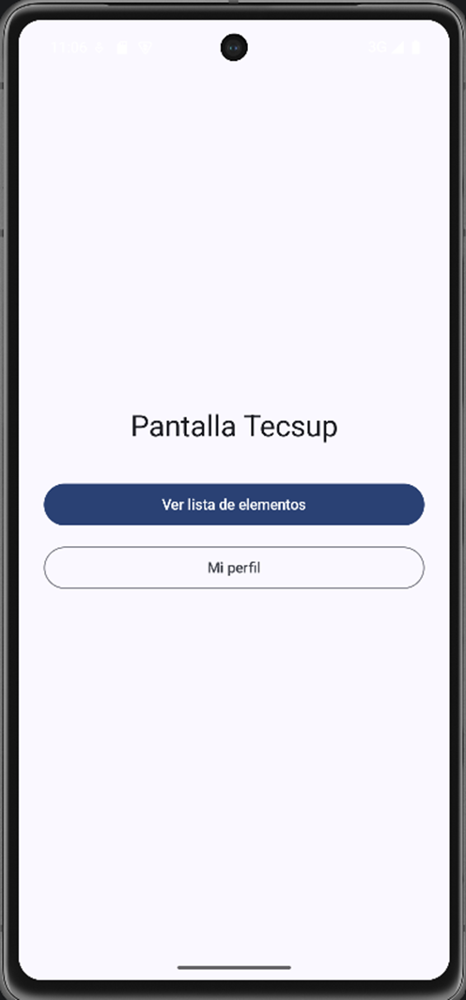
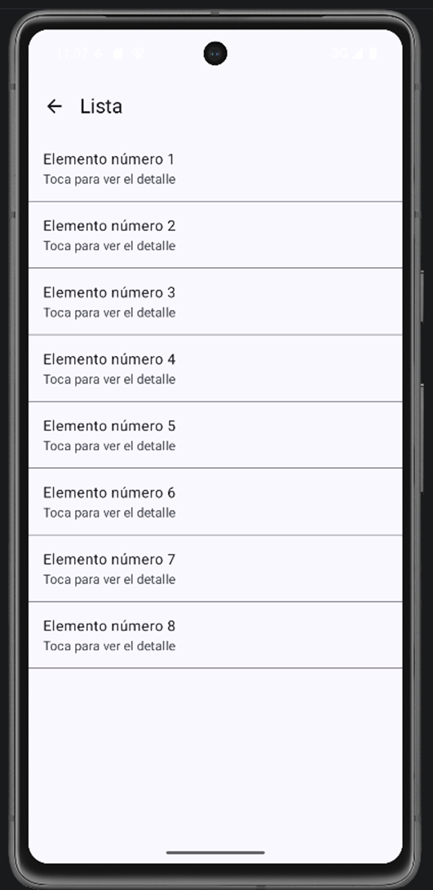
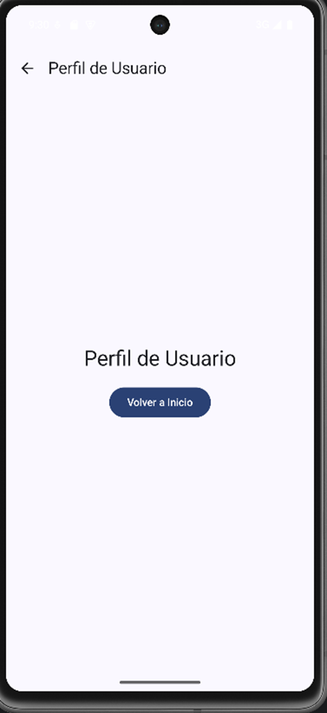
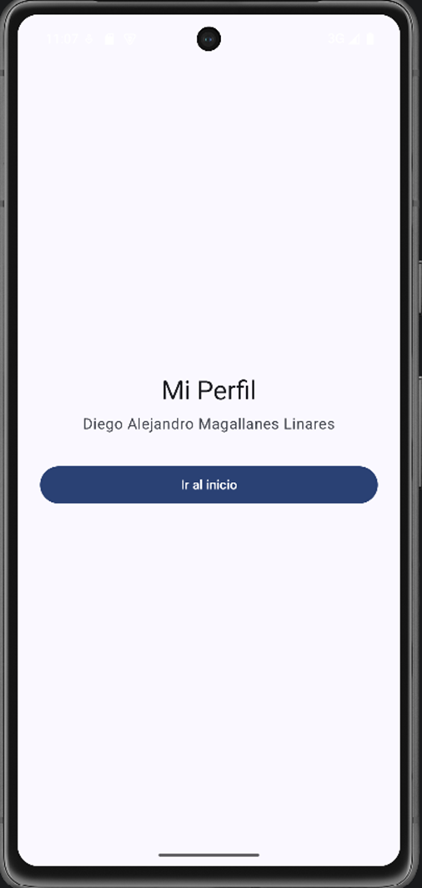
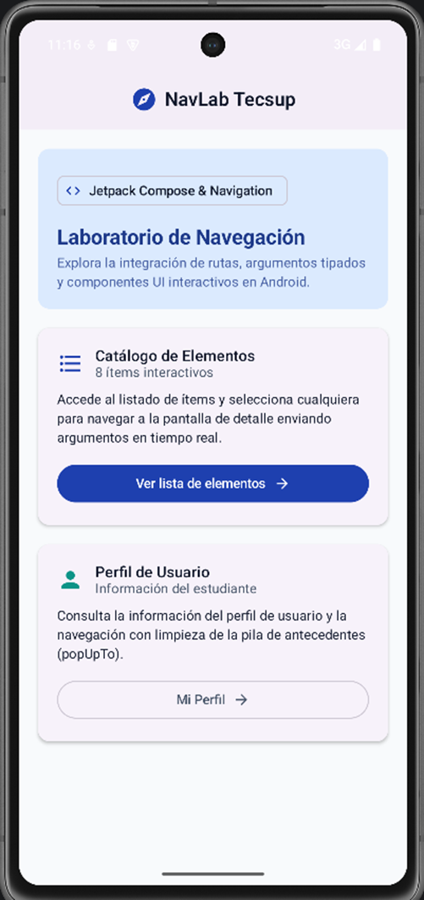
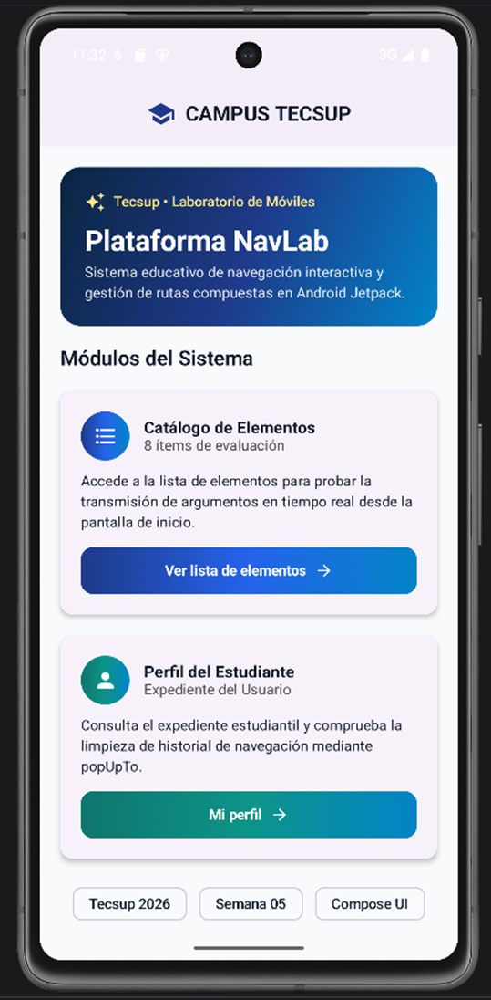
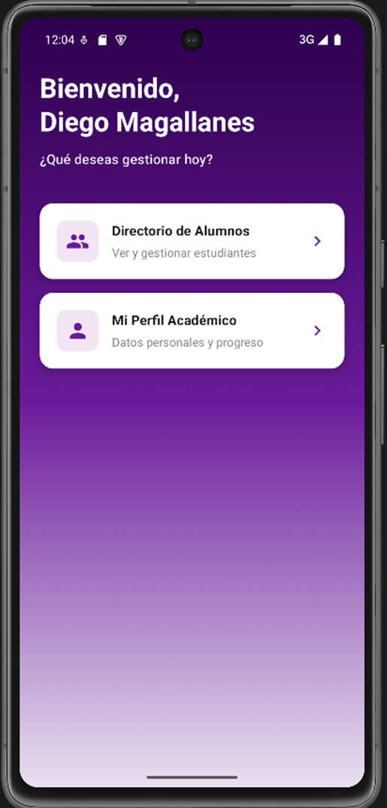
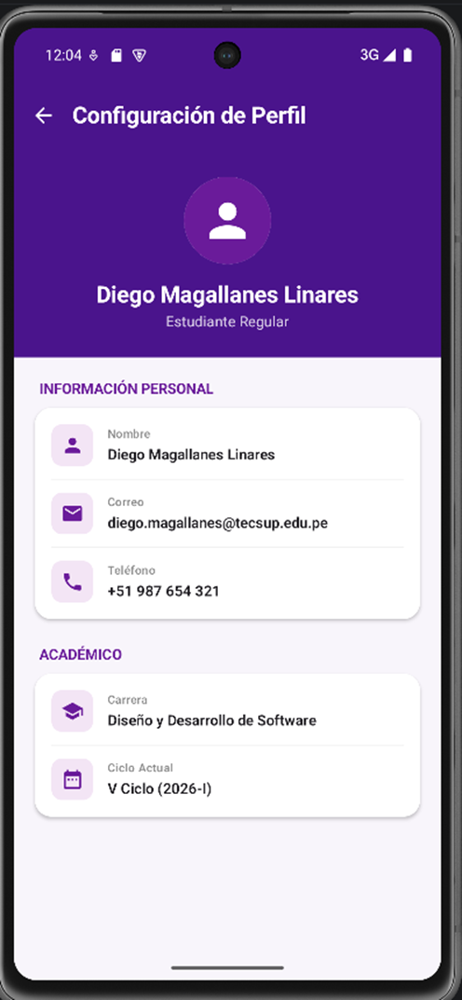

# Laboratorio 05: Navegación en Jetpack Compose (NavLab)

* **Estudiante:** Diego Magallanes
* **Curso:** Programación Móviles
* **Docente:** Juan León
* **Institución:** Tecsup

---

## Descripción del Proyecto
Proyecto desarrollado en Android Studio con **Jetpack Compose** y **Material 3**. Implementa el flujo de navegación entre pantallas utilizando `NavHost`, `NavController` y el manejo de rutas mediante una `sealed class`.

En la segunda fase del laboratorio se mejoró el diseño visual transformándolo en un **Portal Académico** (estilo morado con tarjetas y expedientes) manteniendo la misma lógica de navegación y paso de argumentos (`itemId`).
## Actividad 1:

## Actividad 2:
### Primer intento usando IA
### Promp utilizado:
Imagina que eres un programador en móviles y además tienes conocimientos desarrollados sobre interfaces, quiero que evalúes mi aplicación y mejores el diseño visual de esta.

### Segundo intento
### Prompt utilizado

### Tercer intento
### Prompt utilizado:

